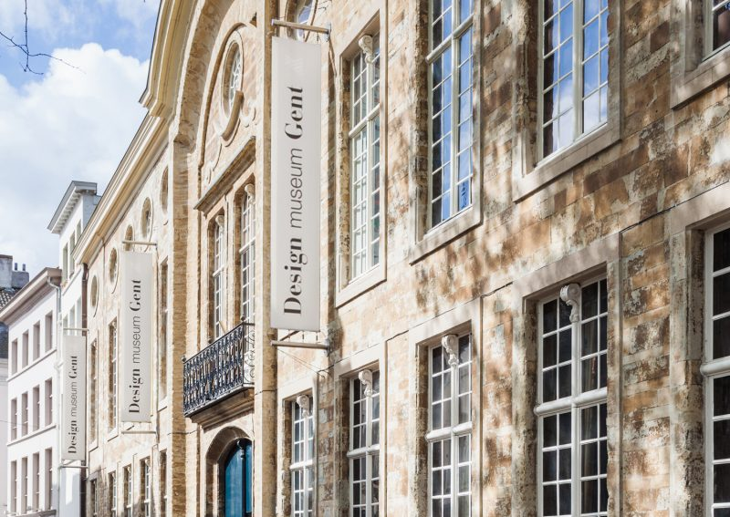

Opdracht
--------
### Omschrijving
Je werkt in groep één project uit dat bestaat uit verschillende deelopdrachten. De resultaten van de deelopdrachten kunnen deliverables zijn en/of een onderdelen van het productiedossier.

### Algemene Probleemstelling
Een museum wil de bezoeker een nieuwe gebruikersbeleving (Eng.: User Experience) geven door gebruik te maken van smartwatch en smartphone.

### Algemene Aanpak
Stel een groep samen van maximaal 2 studenten.
Kies met je groep een bestaand museum dat je ook echt gaat bezoeken.
Voer de deelopdrachten uit.

### Overzicht Deelopdrachten
 - Analyse
 - Concept
 - Smartwatch-app
 - Smartphone-app
 - Website
 - Digital UI Style Guide
 - Productiedossier

Teamleden
---------

 - Mathilde Waeterloos
 - Marthe De Boeck

Gekozen Museum
--------------
### Design museum Gent
Design museum Gent is een museum met een omvangrijke collectie Belgisch en internationaal design. De verzameling omvat ontwerpen van de art nouveau van Henry Van de Velde tot de hedendaagse avantgarde-vormgeving. Het museumcomplex, gelegen in het toeristische hart van de stad Gent, bestaat uit een 18e-eeuws herenhuis en een moderne vleugel.

      
