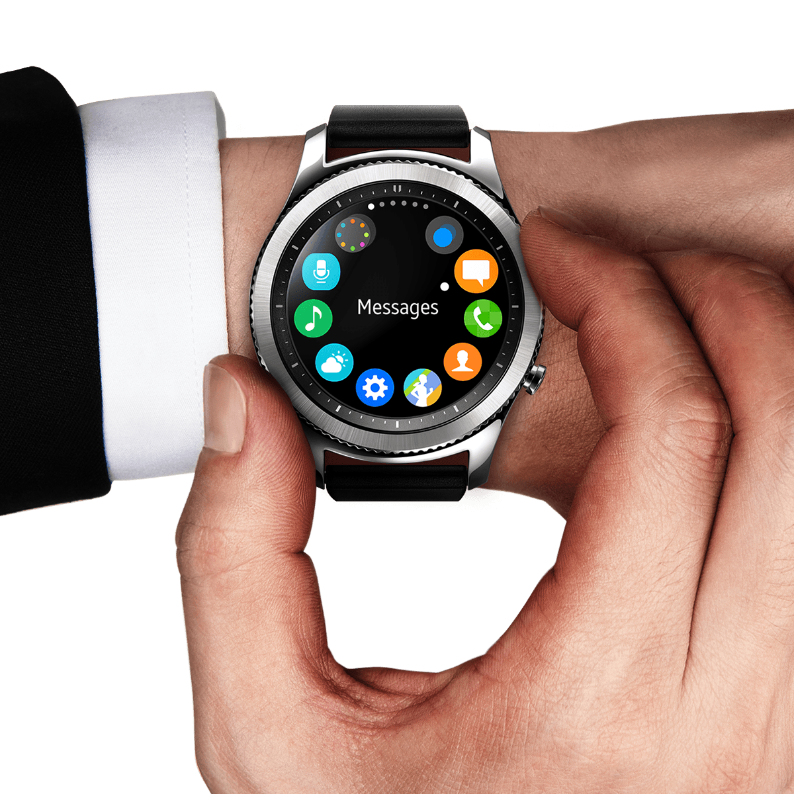
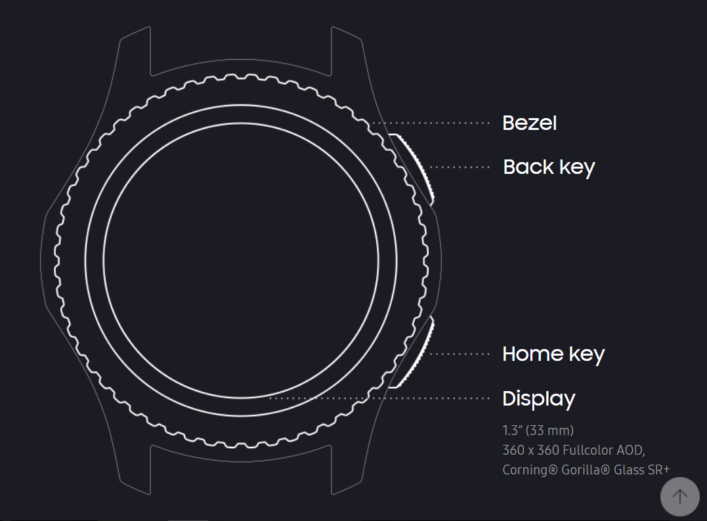
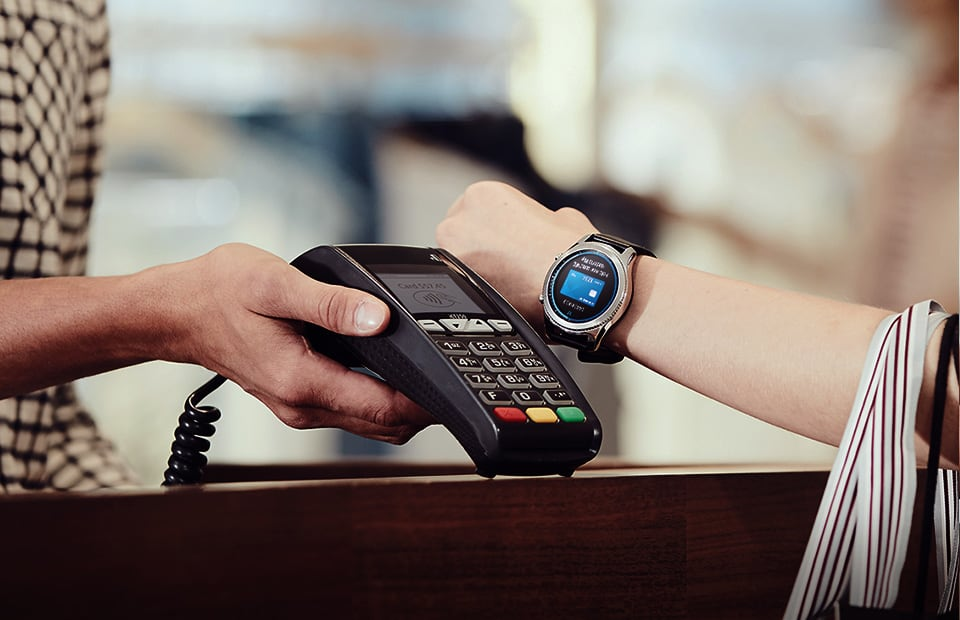
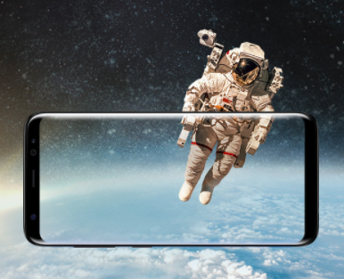
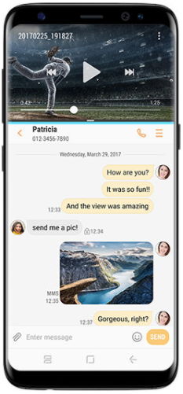

Smartwatch: Samsung Gear S3 classic
-----------------------------------

### Gebruik

Ziet er op het eerste zicht uit als een gewoon horloge (dezelfde knoppen aan zijkant, draaiwiel…)
Het hoofdonderdeel is de draairing. Deze draai je om een oproep te beantwoorden, volume te regelen, te scrollen door apps, berichten en tekst…
Uiterst geschikt voor tijdens het sporten
Display look kan veranderd worden naar eigen voorkeur.

### Technische specificaties	
Ingebouwde speaker om te kunnen bellen via het horloge
Lange batterijduur. Kan, fhankelijk van de instellingen en gebruik, tot 4 dagen zonder opladen.
Ingebouwde GPS en meet kan ook zonder je gsm je afgelegde afstanden vastleggen (tijdens het lopen, golfen…).
Compatibel met zowel iOS (vanaf iOS 9.0)  als Android (vanaf Android 4.4).
WIFI connectivity

### Knoppen
 - Draairing
 - Terugknop aan zijkant
 - Homeknop aan zijkant
 - Touch display voor andere selecties  of handelingen

### Ontwerp richtlijnen
Info moet in een oogwenk duidelijk meegedeeld kunnen worden. 
Gebruiker moet snel kunnen interageren door gebruik te maken van de interface
Ontwerp voor een rond display
Klein display, dus kleine densiteit voor infoweergave

### Extra 
 - Betalen met NFC of MST (draadloze communicatie)

 - Muziek luisteren kan via de bluetooth connectie van je gsm. Horloge heeft ook 4GB intern geheugen waardoor je ook muziek kan luisteren zonder je gsm bij te hebben.
 - App downloads gaan via de Gear App Store
 - Heeft S voice als personal assistant (zetten van alarm)
 - Altimeter, speedometer, barometer aanwezig
 - SOS service: 3 keer klikken op homebutton contacteert alarmdiensten
 - Wireless charging
 - Water en stof resistent

Smartphone: Samsung Galaxy S8 
-----------------------------

### Gebruik 
 - Gemaakt om voor iedereen beter toegankelijk te zijn. 
 - Comfortabel in 1 hand.
 - Je ziet alleen content, bijna geen rand meer. 
 - Dankzij grote scherm → multitasken, focus verleggen door vensters groter of kleiner te maken. 
 - Overzichtelijke en stijlvolle bedienigsinterface. 

### Technische specificaties 
 - Draadloos opladen mogelijk.
 - Infinity display → on-onderbroken, gestroomlijnd oppervlak zonder hoeken of randen en helemaal van glas. Een Ful Frontal, edge-to-edge  scherm zonder enige omlijsting. Full HD+
 - Beeldverhouding van 18,5:9
 - 12 MP achtercamera en 8 MP frontcamera  → uitstekend afgeregeld voor helderen goed belichte foto’s, zelfs wanneer er weinig licht is.
 - Je kan de ‘Pro-modus’ aanzetten en dan kan je de ISO, sluitertijd, belichting, kleurtoon, handmatig scherpstellen en witbalans aanpassen. 
 - Gezichtsherkenning,iris-scanner en vingerafdrukscanner (onzichtbare druksensor) 
 - Bixby:  Je kan via de camera of een afbeelding zoekresultaten vinden. Product, locatie, restaurants in de buurt of een document vertalen. Druk op de Bixby-toets of veeg naar rechts over het vergrendelscherm of startscherm voor gerichte informatie en directe toegang tot de apps die je op dat moment, op die plaats en voor die gelegenheid nodig hebt. Het kan je waarschuwen om dingen te doen, bv de planten water geven, iemand terug bellen … Je kan herinneringen altijd laten zien op het Always On Scherm, Bixby Home scherm of edge randscherm. 
 - VR en streamen op 360 graden (met gear 360 lensen) 

### Knoppen
 - Volume regeling
 - Vergrendelen 
